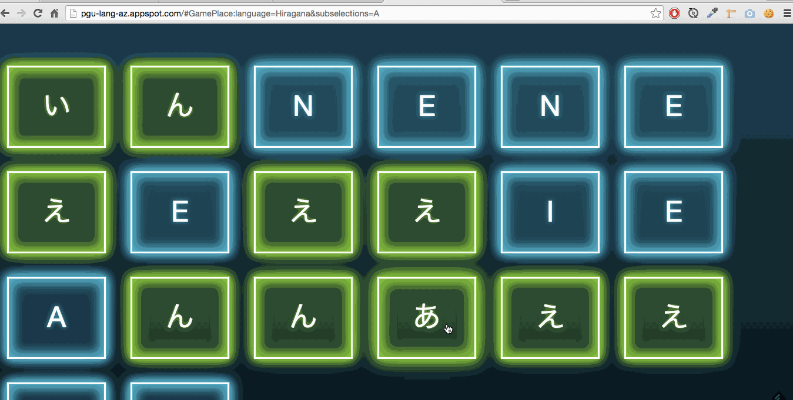

Website
---
[**&#8594; Play!**] [pgu_lang_az]

Purpose
---
Game for learning alphabets, step by step. The rule is simply to associate the symbols to their latin counterparts.

Current alphabets
---
- Hiragana あ お い う え...
- Katakana ア オ イ ウ エ...
- Korean ㄱ ㄴ ㄷ ㄹ ㅁ...
- Russian Б Г Д Ж Ф...
- Arabic ﺏ ﺥ ﺱ ﻁ ﻑ ﻙ...

Technologies
---
- [GWT]

Note that the style is done for use on a mobile phone.

[GWT]: https://developers.google.com/web-toolkit/
[pgu_lang_az]: http://pgu-lang-az.appspot.com/
